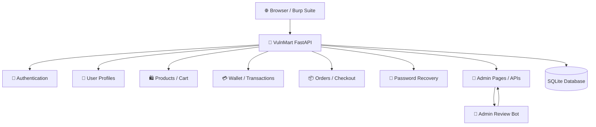
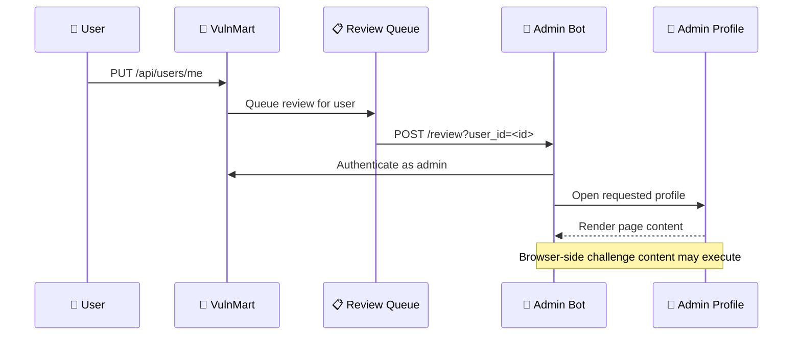
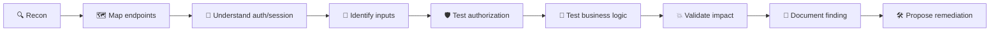

# 🛒 VulnMart

> An intentionally vulnerable e-commerce application built as a practical **Web Pentest / AppSec learning laboratory**.

<p align="center">
  <a href="#-start-here"><strong>🚀 Start Lab</strong></a> ·
  <a href="#-lab-map"><strong>🗺️ Lab Map</strong></a> ·
  <a href="#-testing-workflow"><strong>🔎 Testing Workflow</strong></a> ·
  <a href="#-reporting-findings"><strong>📝 Reporting</strong></a>
</p>

<p align="center">
  
  
  
  
</p>

VulnMart simulates an online marketplace with user accounts, products, wallets, orders, payments, password recovery, administrative functionality, and security-testing scenarios.

The project is designed to be used like a small real-world target: learners interact with the application through the browser and API, inspect requests with tools such as Burp Suite, identify trust-boundary issues, and validate exploitation through realistic application flows.

> **Learning philosophy:** the objective is not merely to "get the flag". The intended outcome is to understand **what you control → where the input goes → what the server trusts → why the control fails → what the real impact is → how to fix it**.

---

## 🧭 Table of Contents

- [🎯 Start Here](#-start-here)
- [🧪 Lab Progress](#-lab-progress)
- [🗺️ Lab Map](#-lab-map)
- [🎯 Project Goals](#-project-goals)
- [🧩 Main Components](#-main-components)
- [🏗️ Architecture](#️-architecture)
- [🛠️ Tech Stack](#️-tech-stack)
- [📁 Project Structure](#-project-structure)
- [🚀 Installation & Running the Lab](#-installation--running-the-lab)
- [🔐 Environment Configuration](#-environment-configuration)
- [🤖 Admin Review Flow](#-admin-review-flow)
- [🔄 Resetting the Lab](#-resetting-the-lab)
- [🔎 Testing Workflow](#-testing-workflow)
- [📝 Reporting Findings](#-reporting-findings)
- [⚠️ Security Notice](#️-security-notice)
- [🎓 Educational Philosophy](#-educational-philosophy)
- [🌐 Deployment](#-deployment)
- [👤 Project](#-project)

---

## 🚀 Start Here

### What is VulnMart?

VulnMart is a deliberately vulnerable marketplace used to practice **black-box web application security testing**. You can approach it from a browser, through HTTP/API requests, and with a proxy such as Burp Suite.

### What can I practice?

| Area                  | Examples of what to investigate                                |
| --------------------- | -------------------------------------------------------------- |
| 🔍 Recon              | Pages, endpoints, parameters, attack surface                   |
| 🔐 Authentication     | Login, session handling, JWT behavior                          |
| 🛡️ Authorization      | IDOR / BOLA-style access-control boundaries                    |
| 🧠 Business Logic     | Wallet, checkout, orders, currency/exchange flows              |
| 🧪 Input Handling     | Validation, encoding, user-controlled content                  |
| 🌐 API Security       | Request/response behavior, object references, trust boundaries |
| 🤖 Client/Admin Flows | Browser-side execution and administrator review scenarios      |

<details>
<summary><strong>🧑‍💻 Recommended mindset</strong></summary>

Do not begin by throwing random payloads at every endpoint.

Start with a simple loop:

```text
OBSERVE
   ↓
MAP THE FLOW
   ↓
FORM A HYPOTHESIS
   ↓
TEST THE HYPOTHESIS
   ↓
VALIDATE IMPACT
   ↓
UNDERSTAND ROOT CAUSE
   ↓
PROPOSE REMEDIATION
```

</details>

---

## 🧪 Lab Progress

Use the checklist below as a lightweight progress tracker while working through the lab.

### Foundation

- [ ] Start VulnMart successfully
- [ ] Start the Admin Bot successfully
- [ ] Open the application in a browser
- [ ] Proxy browser traffic through Burp Suite
- [ ] Identify the main application pages
- [ ] Identify interesting API endpoints

### Authentication & Sessions

- [ ] Inspect login requests
- [ ] Inspect JWT structure and claims
- [ ] Understand browser session bridging
- [ ] Identify authentication trust boundaries

### Authorization & API

- [ ] Test object references and ownership checks
- [ ] Compare behavior between different users
- [ ] Investigate IDOR / BOLA-style scenarios
- [ ] Test server-side authorization decisions

### Business Logic

- [ ] Trace cart → checkout → order flow
- [ ] Inspect wallet and transaction behavior
- [ ] Inspect currency/exchange functionality
- [ ] Look for client-side values that should be server-controlled

### Admin / Browser Review

- [ ] Understand the admin review queue
- [ ] Trace user-controlled profile data into the admin workflow
- [ ] Observe browser-side challenge execution

### Reporting

- [ ] Write a concise vulnerability description
- [ ] Record reproduction steps
- [ ] Capture a minimal proof of concept
- [ ] Explain impact
- [ ] Identify root cause
- [ ] Propose remediation

> 💡 **Tip:** Keep this checklist in your fork or lab notes and tick items off as you learn.

---

## 🗺️ Lab Map

The table below is the intended mental map of the application.



### 🔬 Suggested attack-surface tour

```text
Public pages
   ↓
Authentication
   ↓
Authenticated user features
   ↓
API endpoints
   ↓
Object ownership / authorization
   ↓
Business logic
   ↓
Admin-only functionality
   ↓
Admin review automation
```

<details>
<summary><strong>Why this order?</strong></summary>

It helps establish the normal application behavior before testing security boundaries. Once you understand a legitimate flow, it becomes much easier to spot where an attacker can manipulate an identifier, role, state, or assumption.

</details>

---

## 🎯 Project Goals

VulnMart was built to provide a controlled environment for practicing:

- Web application reconnaissance and attack-surface mapping
- API testing
- Authentication and authorization testing
- JWT/session analysis
- Input validation and output encoding analysis
- Business-logic testing
- IDOR / BOLA-style access-control testing
- Client-side and server-side trust-boundary analysis
- Black-box exploitation using browser and HTTP tooling

The goal is not only to "get the flag", but to understand **why the vulnerability exists, how the application processes the request, and what a proper fix would look like**.

---

## 🧩 Main Components

### 🛒 VulnMart Web Application

The main FastAPI application provides:

- User registration and authentication
- JWT-based authentication
- Browser session bridging
- User profiles
- Products and categories
- Shopping cart
- Checkout and orders
- Wallets and transactions
- Currency/exchange functionality
- Password recovery
- Administrative pages and APIs
- Security-lab challenge scenarios

### 🤖 Automated Admin Review Bot

VulnMart also includes an isolated Playwright-based admin bot.

The bot:

1. Logs in as the configured admin account
2. Obtains the application's JWT
3. Stores the token in the browser context
4. Creates the application's HttpOnly session through `/api/auth/set-session`
5. Opens the requested admin profile
6. Waits for page activity so browser-side challenge payloads can execute

This component is used to reproduce a realistic **"administrator reviews user-submitted content"** workflow.

---

## 🏗️ Architecture

```text
                       ┌──────────────────────┐
                       │       Browser        │
                       │  Burp / Chrome etc.  │
                       └──────────┬───────────┘
                                  │
                                  ▼
                       ┌──────────────────────┐
                       │      VulnMart        │
                       │      FastAPI :8000   │
                       └───────┬─────────┬────┘
                               │         │
                        SQLite │         │ HTTP
                               │         ▼
                               │  ┌──────────────────────┐
                               │  │    Admin Bot :9000   │
                               │  │ Playwright / Chromium │
                               │  └──────────────────────┘
                               │
                               ▼
                       ┌──────────────────────┐
                       │   data/vulnmart.db  │
                       │       SQLite        │
                       └──────────────────────┘
```

The admin bot and VulnMart share the Docker network `ctfd_default`.

In production, the admin bot's port is intentionally **not exposed publicly**. It is only reachable from the internal Docker network.

---

## 🛠️ Tech Stack

| Component          | Technology                        |
| ------------------ | --------------------------------- |
| Backend            | FastAPI                           |
| ORM                | SQLAlchemy                        |
| Database           | SQLite                            |
| Templates          | Jinja2                            |
| Browser automation | Playwright                        |
| Browser            | Chromium                          |
| Containerization   | Docker / Docker Compose           |
| Authentication     | JWT + HttpOnly session cookie     |
| Testing workflow   | Burp Suite / browser / HTTP tools |

---

## 📁 Project Structure

```text
vulnmart/
├── app/
│   ├── models/
│   ├── routes/
│   ├── database.py
│   ├── database_seed.py
│   └── main.py
│
├── admin-bot/
│   ├── bot.py
│   ├── Dockerfile
│   ├── docker-compose.yml
│   └── requirements.txt
│
├── data/
│   └── vulnmart.db
│
├── static/
├── templates/
├── Dockerfile
├── docker-compose.yml
├── requirements.txt
└── README.md
```

---

## 🚀 Installation & Running the Lab

VulnMart and the Admin Bot are intentionally separated into two Docker Compose projects.

### 1️⃣ Start VulnMart

```bash
cd /opt/vulnmart
docker compose up -d
```

Check:

```bash
docker ps --filter name=vulnmart
```

### 2️⃣ Start the Admin Bot

```bash
cd /opt/vulnmart/admin-bot
docker compose up -d
```

Check:

```bash
docker ps --filter name=vulnmart-admin-bot
```

<details>
<summary><strong>▶ Start both services in one sequence</strong></summary>

```bash
cd /opt/vulnmart
docker compose up -d

cd /opt/vulnmart/admin-bot
docker compose up -d
```

</details>

### 🌐 Access the Lab

| Environment                       | URL                                  |
| --------------------------------- | ------------------------------------ |
| Local                             | `http://localhost:8000`              |
| Production/private lab deployment | `https://vulnmart.rootacademy.my.id` |

### ✅ Verify Startup

VulnMart:

```bash
docker logs -f vulnmart
```

Admin Bot:

```bash
cd /opt/vulnmart/admin-bot
docker logs -f vulnmart-admin-bot
```

A healthy Admin Bot startup should end with:

```text
[BOT] Admin login successful
[BOT] Admin session verified
[BOT] Admin bot ready
[BOT] Review worker started
```

<details>
<summary><strong>🛑 Stop the lab</strong></summary>

```bash
cd /opt/vulnmart
docker compose down

cd /opt/vulnmart/admin-bot
docker compose down
```

</details>

<details>
<summary><strong>🔨 Rebuild after code changes</strong></summary>

```bash
cd /opt/vulnmart
docker compose up -d --build

cd /opt/vulnmart/admin-bot
docker compose up -d --build
```

</details>

---

## 🧼 Fresh Database Reset

Use this only when you want to completely reset the lab state and remove previous testing data.

```bash
cd /opt/vulnmart

docker compose down

rm -f data/vulnmart.db

docker compose up -d --build

docker exec vulnmart python -m app.database_seed
```

Then restart the Admin Bot:

```bash
cd /opt/vulnmart/admin-bot

docker compose down
docker compose up -d
```

> **Note:** You do not need to run the seed every time you start the lab. Only run `database_seed.py` after intentionally removing the database or when creating a fresh lab state.

---

## 🧑‍💻 Running Locally

### 1. Start VulnMart

```bash
cd vulnmart
docker compose up -d --build
```

The application will be available at:

```text
http://localhost:8000
```

### 2. Create a fresh database

The seed script is intentionally standalone.

```bash
docker exec vulnmart python -m app.database_seed
```

A fresh seed creates the default demonstration users and marketplace data.

### 3. Start the Admin Bot

```bash
cd vulnmart/admin-bot
docker compose up -d --build
```

Check the logs:

```bash
docker logs -f vulnmart-admin-bot
```

A healthy startup should end with messages similar to:

```text
[BOT] Admin login successful
[BOT] Admin session verified
[BOT] Admin bot ready
[BOT] Review worker started
```

---

## 🔐 Environment Configuration

The admin bot reads its runtime configuration from:

```text
admin-bot/.env
```

Example:

```env
APP_API_URL=http://vulnmart:8000
APP_BROWSER_URL=http://vulnmart:8000

ADMIN_USERNAME=admin
ADMIN_PASSWORD=<your-admin-password>

BOT_TRIGGER_SECRET=<your-shared-secret>

REVIEW_WAIT_SECONDS=5
```

### 🔒 Important

Do **not** commit `admin-bot/.env` to Git.

The repository should keep secrets in environment variables rather than hard-coding operational credentials into source files.

<details>
<summary><strong>✅ Suggested repository hygiene</strong></summary>

```text
admin-bot/
├── .env              ← local secret configuration (do not commit)
├── .env.example      ← safe template for the repository
└── ...
```

</details>

---

## 🤖 Admin Review Flow

When a user profile is updated, VulnMart can enqueue an admin review.



Conceptually:

```text
User updates profile
        │
        ▼
PUT /api/users/me
        │
        ▼
VulnMart triggers review
        │
        ▼
POST /review?user_id=<id>
        │
        ▼
Admin Bot queue
        │
        ▼
Playwright opens admin profile
        │
        ▼
Browser executes page content
```

The review mechanism exists specifically to support controlled security-lab scenarios involving administrator interaction with user-controlled content.

---

## 🔄 Resetting the Lab

For a completely clean training environment, remove the SQLite database and seed it again.

```bash
cd /opt/vulnmart

docker compose down

rm -f data/vulnmart.db

docker compose up -d --build

docker exec vulnmart python -m app.database_seed
```

Then restart the admin bot if necessary:

```bash
cd /opt/vulnmart/admin-bot

docker compose down
docker compose up -d
```

This is useful after repeated testing when you want to return the lab to a known baseline.

---

## 🔎 Testing Workflow

VulnMart is intended to be approached as a black-box target.

### 🧠 The methodology



### Step-by-step

| Step              | Goal                          | Typical questions                                           |
| ----------------- | ----------------------------- | ----------------------------------------------------------- |
| 1. Recon          | Understand the attack surface | What pages, endpoints, parameters and roles exist?          |
| 2. Map flows      | Establish normal behavior     | What happens from login → action → response?                |
| 3. Auth/session   | Understand trust              | Where is identity stored and how is it checked?             |
| 4. Inputs         | Find attacker-controlled data | Which fields, IDs, URLs, headers or bodies can I influence? |
| 5. Authorization  | Test boundaries               | Does the server verify ownership and role on every request? |
| 6. Business logic | Test assumptions              | Can I change state, price, quantity, balance or sequence?   |
| 7. Impact         | Confirm security significance | What can an attacker actually achieve?                      |
| 8. Root cause     | Explain why                   | Which missing or incorrect control enables it?              |
| 9. Remediation    | Fix the issue                 | What server-side defensive control should exist?            |

### 🧰 Useful Tools

- Burp Suite
- Browser DevTools
- `curl`
- `ffuf`
- `Nmap`
- `httpx`
- Custom Python scripts

<details>
<summary><strong>🧪 Example: request-analysis loop</strong></summary>

```text
1. Perform a legitimate action in the browser
2. Capture the request in Burp Suite
3. Identify identifiers and security-sensitive fields
4. Replay the request
5. Change one variable at a time
6. Compare response + application state
7. Decide whether the server enforced the intended rule
```

> The important part is controlled experimentation: change one assumption at a time so you know which input caused the behavior.

</details>

---

## 📝 Reporting Findings

For each vulnerability, document at least:

### Description

Explain what is happening and where the trust boundary is broken.

### Proof of Concept

Provide the minimum request / payload / sequence required to reproduce the issue.

### Impact

Explain what an attacker can actually achieve.

### Root Cause

Describe the application logic that makes the vulnerability possible.

### Remediation

Explain the appropriate defensive control.

### 📄 Recommended Write-up Template

<details>
<summary><strong>Click to expand a reusable finding template</strong></summary>

````markdown
# [Vulnerability Title]

## Severity

[Critical / High / Medium / Low / Informational]

## Affected Endpoint / Feature

`METHOD /endpoint`

## Description

Explain what is vulnerable and what security boundary is broken.

## Steps to Reproduce

1. Step one
2. Step two
3. Step three

## Proof of Concept

```http
POST /example HTTP/1.1
Host: target.local
Content-Type: application/json

{"example":"value"}
```
````

## Impact

Explain the realistic security impact.

## Root Cause

Explain the vulnerable application logic.

## Remediation

Explain the correct defensive control.

````

</details>

### ✅ Reporting checklist

- [ ] Clear title
- [ ] Severity justified
- [ ] Affected endpoint/feature identified
- [ ] Reproduction is deterministic
- [ ] PoC is minimal
- [ ] Impact is explained in realistic terms
- [ ] Root cause is tied to application behavior
- [ ] Remediation is actionable

---

## ⚠️ Security Notice

VulnMart is intentionally vulnerable.

It should only be deployed in:

- Local development environments
- Isolated CTF infrastructure
- Private training environments
- Other systems where you have explicit authorization

> 🚨 **Do not expose an unmodified VulnMart instance as a normal public production application.**

---

## 🎓 Educational Philosophy

VulnMart is built around:

> **LEARN → TEST → EXPLOIT → UNDERSTAND → FIX**

A good lab solve should answer:

1. What input can I control?
2. Where does that input go?
3. What does the server trust?
4. What security control is missing or incorrectly implemented?
5. What is the real security impact?
6. How would I fix it?

### 🧩 What "solved" means here

<details>
<summary><strong>Not just a flag</strong></summary>

A challenge is truly understood when you can explain both sides:

```text
Attacker perspective                 Defender perspective
────────────────────                 ────────────────────
What can I control?          ↔       What should be trusted?
What request can I alter?    ↔       What must be validated?
What boundary can I cross?   ↔       What authorization is missing?
What impact can I cause?     ↔       What control prevents it?
````

</details>

---

## 🌐 Deployment

VulnMart can be containerized and placed behind a reverse proxy for a private training environment.

For production-like lab deployments, keep the following separated:

```text
Internet
   │
   ▼
Reverse Proxy
   │
   ▼
VulnMart :8000
   │
   └────── internal Docker network ──────► Admin Bot :9000
```

The admin bot should remain an **internal service** and should not be directly exposed to the public Internet.

---

## 👤 Project

### VulnMart

**An educational vulnerable marketplace for Web Pentest, AppSec, and CTF practice.**

Built for hands-on security experimentation and black-box vulnerability research.

<p align="center">
  <sub>🧪 Learn by testing · 🔍 Understand the root cause · 🛠️ Think like a defender</sub>
</p>
